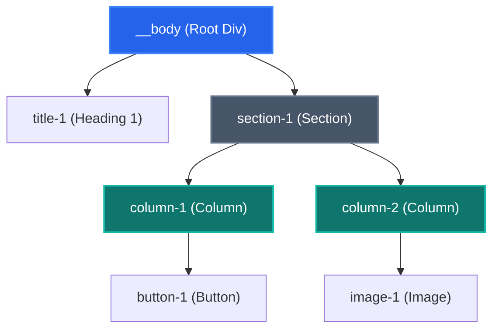
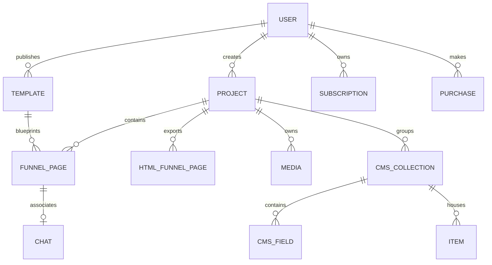
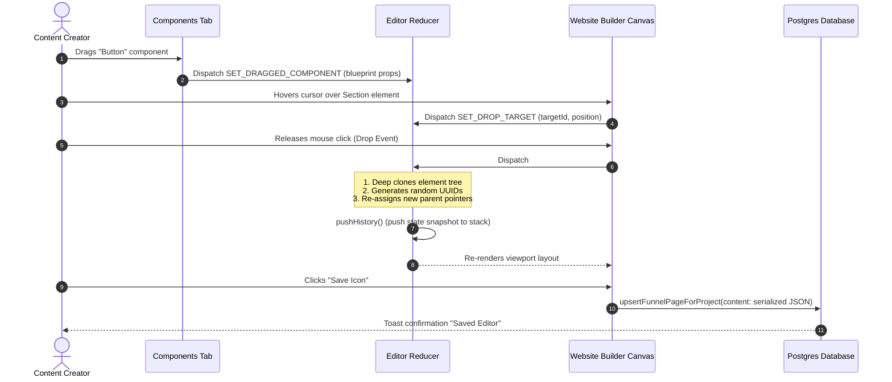
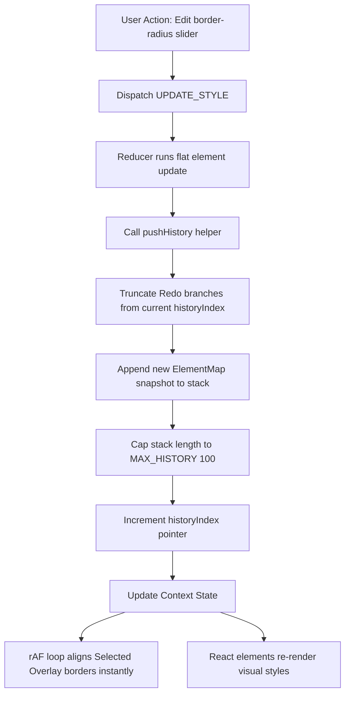
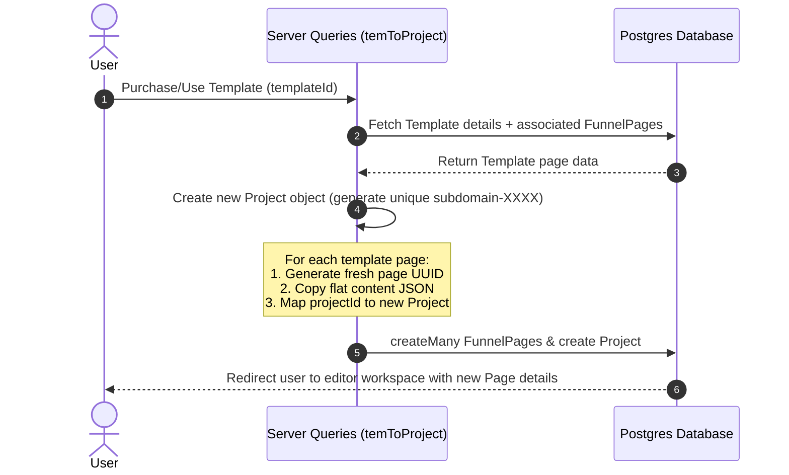

# Azeorex Editor: Complete Architecture, Design, & Workflow Specification

This document provides a deep, comprehensive breakdown of the Azeorex website and funnel editor's architecture, state machine, front-end rendering engines, visual overlays, and back-end database schemas.

---

## 1. Architectural Overview & State Patterns

The Azeorex Editor is built as a single-page visual builder using **React (Next.js)**, utilizing a highly optimized, client-side state machine.

### Flat-Mapped Element Tree (ElementMap)
Traditional page builders store element nodes recursively (a nested JSON tree of children). Recursion degrades performance on deep trees and causes complex re-rendering side effects during updates or moves.

Azeorex bypasses these limitations using a **Flat-Mapped State Pattern**:
- **Normalized Storage**: Every element is saved flat in a single object `ElementMap` where keys are unique IDs and values are `EditorElement` objects.
- **Pointer-Based Trees**: Element nesting is represented by parent-child pointer arrays. A parent element maintains a string array of its immediate children's IDs (`children: string[]`), and each child holds its parent's ID (`parentId: string | null`).
- **O(1) Lookups & Updates**: To modify a specific element style or content, the editor targets the ID directly in the map: `elements[id] = updatedElement`, avoiding recursive traversals.



### Core Editor State Schema
The main state which we change and manage for editing that is Editorstate. And the Object structure is 

#### State Object Structure
```typescript
export type EditorState = {
  elements: ElementMap;                 // Flat dictionary lookup of all editor elements
  selectedId: string | null;            // Currently active/clicked element ID
  selectedElement: EditorElement | null;// Reference to the selected element's data
  hoverId: string | null;               // Element currently hovered by the user's cursor
  draggedId: string | null;             // ID of the existing canvas element being dragged
  draggedComponent: EditorElement | null; // Element blueprint being dragged from the components panel
  dropTargetId: string | null;          // ID of the element over which a drop is hovered
  dropPosition: DropPosition | null;    // "before" | "after" | "inside"
  history: HistoryState[];              // Undo stack tracking elements & selectedId snapshots
  historyIndex: number;                 // Current pointer position in the history array
  device: DeviceType;                   // Current viewport: "Desktop" | "Tablet" | "Mobile"
  previewMode: boolean;                 // Hides sidebars & builder controls
  liveMode: boolean;                    // Render as a live preview without editor event listeners
  saveLoading: boolean;                 // Tracks database save states
};
```

---

## 2. Reducer Actions & State Transitions

The editor state changes exclusively through dispatched `EditorAction` events. The reducer processes flat transformations, history stack truncation, and deep cloning on copy/insert operations:

| Action Type | Payload Type | Description |
| :--- | :--- | :--- |
| `LOAD_DATA` | `{ elements: ElementMap, liveMode: boolean }` | Initialize    the editor with saved JSON from the database. Resets history. |
| `INSERT_ELEMENT` | `{ element: EditorElement, targetId: string, position: DropPosition }` | Clones a dragged template component, generates fresh unique IDs for its subtree, and inserts it according to the terget le and position. |
| `MOVE_ELEMENT` | `{ id: string, targetId: string, position: DropPosition }` | Re-orders or re-parents an existing canvas element by updating parent pointers. |
| `DELETE_ELEMENT` | `{ id: string }` | Detaches an element from its parent and recursively deletes its entire subtree from the flat map. |
| `DUPLICATE_ELEMENT` | `{ id: string }` | Deep-clones an element and its descendants with new IDs, placing it immediately after the original. |
| `UPDATE_STYLE` | `{ id: string, property: string, value: string }` | Mutates a single CSS property on the targeted element. |
| `BATCH_UPDATE_STYLES` | `{ id: string, styles: Record<string, string> }` | Applies multiple style properties simultaneously to prevent multiple history commits. |
| `UPDATE_CONTENT` | `{ id: string, content: string }` | Updates content values (e.g. inner text of a heading/paragraph or iframe HTML). |
| `UPDATE_ATTRIBUTE` | `{ id: string, attributeName: string, value: string }` | Alters non-CSS HTML tags (e.g. `src` on an image, `href` on a link, or form placeholders). |
| `UNDO` / `REDO` | *None* | Shifts `historyIndex` down or up, restoring the `elements` and `selectedId` snapshots. |
| `SET_DEVICE` | `{ device: DeviceType }` | Modifies the viewport width to emulate Tablet or Mobile displays. |

---

## 3. UI Component Breakdown & Viewports

The workspace interface is split into three primary areas: navigation/toolbar, visual canvas, and sidebar options.

### Top Navigation & Controls
Implemented in [FunnelEditorNavigation](file:///d:/SAYAN-X/abc/azeorex-v2/src/app/playground/_components/funnel-editor-navigation.tsx):
- **Device Viewport Toggle**: Updates the view widths.
- **Undo / Redo Hooks**: Bound to dispatch types `"UNDO"` and `"REDO"`.
- **Preview Toggle**: Switches `previewMode` state to let creators test hovering and margins cleanly.
- **JSON Exporter / Clipboard Copy**: Copies structural JSON representation of elements or the full page.
- **Save / Sync Engine**: Dispatches database upserts.

### Sidebar Panel tabs
Located in [funnel-editor-sidebar](file:///d:/SAYAN-X/abc/azeorex-v2/src/app/playground/_components/funnel-editor-sidebar):
1. **Components Panel** ([ComponentsTab](file:///d:/SAYAN-X/abc/azeorex-v2/src/app/playground/_components/funnel-editor-sidebar/tabs/components-panal/index.tsx)):
   Lists default elements split into groups (`layout`, `typography`, `media`, `forms`) and enables custom user templates.
   - **Custom Reusable Components**: Allows saving a configured element tree. Clicking "Create Component" clones `state.selectedElement` and stores its nested subtree under a user list for drag-and-drop reuse.
2. **Settings Tab** ([SettingsTab](file:///d:/SAYAN-X/abc/azeorex-v2/src/app/playground/_components/funnel-editor-sidebar/tabs/settings-tab/settings-tab.tsx)):
   Accordion list providing visual inputs for raw style attributes:
   - **Special Attributes**: Link redirects and source URLs (`src`, `href`, `placeholder`).
   - **Dimensions**: Custom widths, min-heights, flex parameters.
   - **Typography**: Fonts, font-size, weights, line-heights, alignments.
   - **Spacing**: Margins and paddings (visually controlled via slide inputs or canvas handles).
   - **Decoration**: Borders (radius, color, thickness) and shadow blur configurations.

### Visual Canvas & Responsive Viewports
The main editing canvas is hosted in [WebsiteBuilder](file:///d:/SAYAN-X/abc/azeorex-v2/src/app/playground/_components/website-builder/index.tsx):
- **Desktop Mode**: Directly maps the react element tree within the editor window. Users can click, drag, resize, edit inline text via `contentEditable={true}`, and watch real-time adjustments.
- **Tablet / Mobile Viewports**: To guarantee responsive correctness (preventing styling leaks from Next.js parent pages), the editor compiles the page state into standard, semantic HTML. It loads this HTML within a sandboxed `<iframe>` pulling Tailwind CDN.
  ```typescript
  // Compiled iframe wrapper preview used for Mobile (420px) and Tablet (850px)
  srcDoc={`<!DOCTYPE html>
  <html>
    <head>
      <meta charset="UTF-8">
      <meta name="viewport" content="width=device-width, initial-scale=1.0">
      <script src="https://cdn.tailwindcss.com"></script>
      <style>* { margin: 0; padding: 0; box-sizing: border-box; }</style>
    </head>
    <body>${rootElements.map(elementToHTML).join("")}</body>
  </html>`}
  ```

---

## 4. Visual Overlays & Drag-and-Drop Math

To avoid UI visual clutter and maintain raw DOM styling, border outlines, selection indicators, handles, and drop signals are drawn dynamically on a top transparent overlay layer instead of directly inside elements.

### High-Performance `requestAnimationFrame` Overlays
React components that update sizes based on input sliders can render with lag. To keep overlay tracking completely lag-free (60fps), components like [GlobalSelectedOverlay](file:///d:/SAYAN-X/abc/azeorex-v2/src/app/playground/_components/overlays/GlobalSelectedOverlay.tsx) bypass the typical React virtual DOM loop:
1. **Direct DOM Mutation**: An animation frame loop queries the active element's bounding rect.
2. **Zero-Lag Matching**: The overlay's coordinates (`left`, `top`, `width`, `height`) are updated via direct DOM element inline style injection in a `requestAnimationFrame` loop.
3. **Optimized Re-rendering**: A local React state `rect` is updated *only* when dimensions actually change, limiting costly child re-renders.

```typescript
const update = useCallback(() => {
  const overlay = overlayRef.current;
  const element = document.querySelector(`[data-element-id="${state.selectedId}"]`);
  if (!overlay || !element) return;

  const r = element.getBoundingClientRect();
  
  // Direct DOM mutation for absolute alignment with mouse action
  overlay.style.left = `${r.left}px`;
  overlay.style.top = `${r.top}px`;
  overlay.style.width = `${r.width}px`;
  overlay.style.height = `${r.height}px`;

  // Trigger state only when physical bounding box is changed
  const prev = lastRectRef.current;
  if (!prev || prev.l !== r.left || prev.t !== r.top || prev.w !== r.width || prev.h !== r.height) {
    lastRectRef.current = { l: r.left, t: r.top, w: r.width, h: r.height };
    setRect(r);
  }
}, [state.selectedId]);
```

### Drag-and-Drop Maths: DropPosition Calculation
When a component is hovered over target boundaries, the drop destination position (`before`, `after`, or `inside`) must be evaluated. In [WebsiteBuilder](file:///d:/SAYAN-X/abc/azeorex-v2/src/app/playground/_components/website-builder/index.tsx#L140-L157):
1. **Bounding Dimensions**: Fetch the target element bounding box: `const rect = e.currentTarget.getBoundingClientRect()`.
2. **Vertical Offset**: Measure the cursor's coordinate offset from target's top boundary: `const offsetY = e.clientY - rect.top`.
3. **Logic Trees**:
   - If the element type is a container (e.g. sections, rows) and the cursor sits between $20\%$ and $80\%$ of its height, position is calculated as `"inside"`.
   - If the cursor rests in the upper half ($<50\%$), position defaults to `"before"`.
   - Otherwise, position resolves as `"after"`.

```
                    +------------------------------------+
                    |             "before"               |   (OffsetY < 20% or 50% height)
                    +------------------------------------+
                    |                                    |
                    |             "inside"               |   (20% <= OffsetY <= 80% on containers)
                    |                                    |
                    +------------------------------------+
                    |             "after"                |   (OffsetY > 80% or 50% height)
                    +------------------------------------+
```

### Custom Margin, Padding, and Resize Handles
Visual overlays mount handlers that allow creators to resize elements directly on the canvas:
- **Resizing**: Dragging bottom/right edges adjusts the element's CSS `width` and `height`.
- **Padding Handles** ([PaddingHandles.tsx](file:///d:/SAYAN-X/abc/azeorex-v2/src/app/playground/_components/overlays/PaddingHandles.tsx)): Hovering over boundaries exposes padding tracks. Dragging changes top/bottom/left/right properties inside the React style state.
- **Margin Handles** ([MarginHandles.tsx](file:///d:/SAYAN-X/abc/azeorex-v2/src/app/playground/_components/overlays/MarginHandles.tsx)): Active margin indicators display exterior spacing. Dragging computes relative displacement adjustments to modify CSS margins on the fly.

---

## 5. Database Tables & Persistent Relational Schema

Persisted schemas are managed via PostgreSQL and Prisma. The schema definitions are located in [schema.prisma](file:///d:/SAYAN-X/abc/azeorex-v2/prisma/schema.prisma).

### Prisma Database Entities



### Table Mappings & Key Columns

#### User
Houses accounts, subscription tier validations, and AI generation credits.
- `id` (String, Primary Key): UUID identifier.
- `name` (String): Username representation.
- `email` (String, Unique): User email address.
- `credits` (Int, default: 1000): Credit balance depleted on AI generation runs.
- `activePlan` (String, default: "Free Plan"): Validated subscription tier limits.
- `role` (Role Enum): Options include `USER`, `ADMIN`, `AGENCY_OWNER`, `AGENCY_USER`, etc.

#### Project
Scopes page collections, subdomains, and media libraries.
- `id` (String, Primary Key): Unique UUID.
- `name` (String): The name of the project.
- `subDomainName` (String, Unique): Next.js routing handle used to publish pages.
- `userId` (String): Foreign key referencing `User`.
- `liveProducts` (String, default: "[]"): Serialized array mapping Stripe integrations.

#### FunnelPage
Core data record where the editor content state is persisted.
- `id` (String, Primary Key): Unique identifier.
- `name` (String): Name display.
- `pathName` (String): The sub-route path (e.g. `/home` or `/about`).
- `content` (String, Nullable): **Serialized JSON String of the flat-mapped `ElementMap`**. Loaded directly to reconstruct editor states.
- `order` (Int): Sorting position within multi-page funnels.
- `projectId` (String, Nullable): Foreign key referencing parent `Project`.
- `templateId` (String, Nullable): References base `Template` if generated from one.

#### HtmlFunnelPage
Stores raw HTML-compiled exports for static sites.
- `id` (String, Primary Key): Unique identifier.
- `name` (String): Page title.
- `content` (String, Nullable): Stored HTML boilerplate containing inline inline styles and headers.

#### CMSCollection
Represents collections of user-defined data structures.
- `id` (String, Primary Key): UUID.
- `name` (String): Collection display name (e.g. "Blog Posts").
- `projectId` (String): References parent `Project`.

#### CMSField
Stores the metadata properties of a collection field.
- `id` (String, Primary Key): UUID.
- `name` (String): Name identifier (e.g. "Author").
- `type` (FieldType Enum): `TEXT`, `IMAGE`, `NUMBER`, `BOOLEAN`, `RICH_TEXT`, etc.
- `collectionId` (String): References `CMSCollection`.

#### Item
Represents specific records saved inside collections.
- `id` (String, Primary Key): UUID.
- `collectionId` (String): References parent `CMSCollection`.
- `values` (Json): JSON blob mapping field IDs to their concrete values.

#### Media
File upload registers.
- `id` (String, Primary Key): UUID.
- `name` (String): Filename description.
- `link` (String, Unique): S3/Upload CDN URL link.
- `projectId` (String, Nullable): Scopes media to specific builders.

#### Subscription
Stripe billing records.
- `id` (String, Primary Key): UUID.
- `subscriptionId` (String, Unique): Stripe session identifier.
- `plan` (String, default: "Free Plan"): Registered plan type.
- `active` (Boolean): Determines whether subscription privileges are currently active.
- `currentPeriodEndDate` (DateTime): Expiry validation date.

---

## 6. End-to-End Visual Workflows

### Drag-and-Drop Component Insertion Workflow
Below is the sequential cycle executed when dragging an element from the sidebar:



### state Updates & History Tracking Workflow
Every style slider change, text entry blur, or element delete follows an auto-history capture pattern:



### Template-to-Project Purchase / Clone Workflow
When a creator selects a site template, the database clones pages into their own project:


